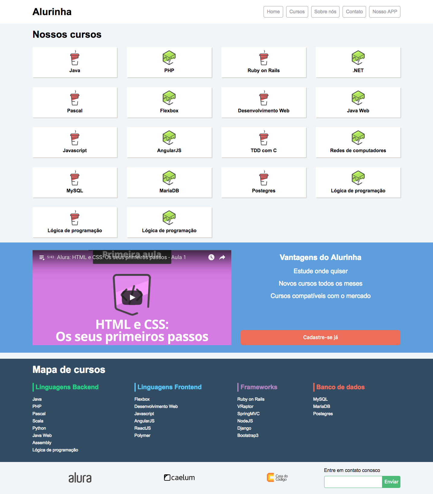

# Site responsivo com flexbox

- Criando um site responsivo com flexbox.

Clique [AQUI](https://alineviana.github.io/flexbox-alura/) para acessar o projeto

 

> ## 📝 Conteúdo: ✨ Curso de Flexbox: posicione elementos na tela ✨
 

- Flexible box para posicionar elementos na página
- Entendendo as diversas propriedades do flexbox e como usá-las
- Entendendo como as propriedades do flexbox substituem float, inline e inline-block
- Criando um site responsivo com flexbox

 

> ## 🖥️ Tecnologias
 

- HTML5
- CSS3
